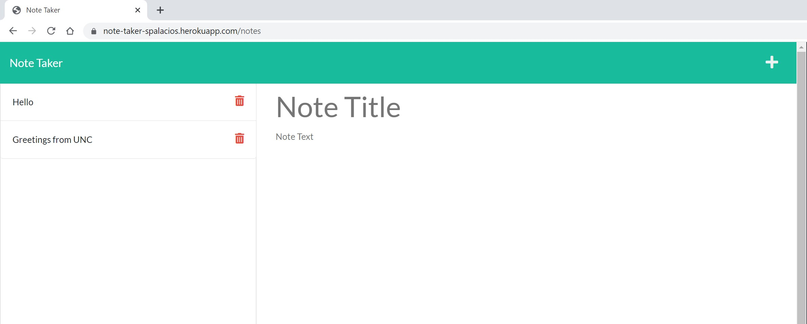
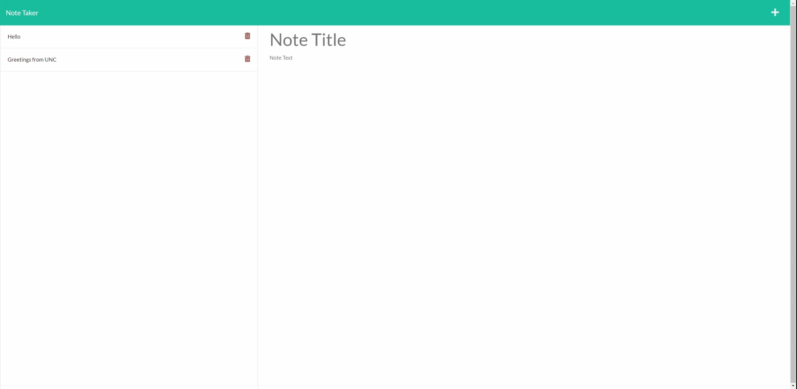
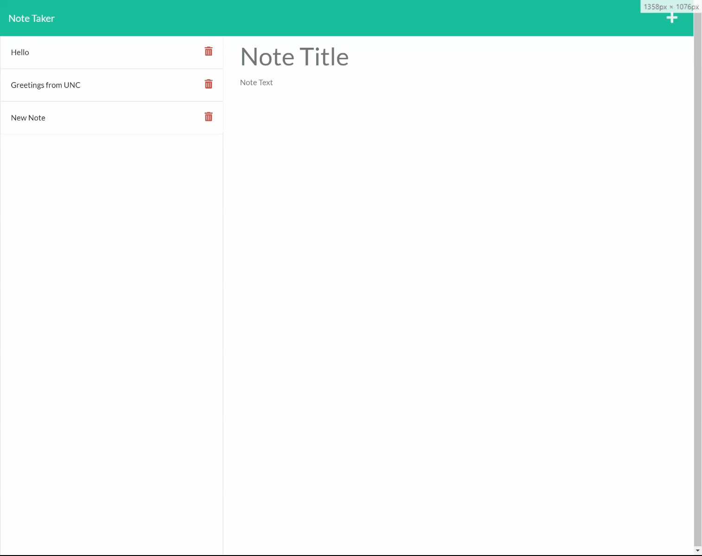

# Express.js
## Homework 11 - Note Taker

Your purpose of this assignment is to build a Express back end that will save, retrieve, and delete note data from a JSON file. 

* The link to the application can be found [here](https://note-taker-spalacios.herokuapp.com/).

<br />

# Acceptance criteria
## :heavy_check_mark: Note Taker app

When visiting the app, user will be presented with a landing page, when following the link to the notes page, you will be redirected to the notes page.
You will presented with existing notes:



When entering a new note and saving it, You will be able to see it show up on the left pane as a new note:



You can also click on the note and it will appear on the right-hand column as a read-only text:



<br />

## :heavy_check_mark: Routes

Routes were created so  `GET /notes` routes to the notes page but anything other than than will route to the main `index.html` page.

```
  app.get('/notes', (req, res) => {
    res.sendFile(path.join(__dirname, '../public/notes.html'));
  });

  // If no matching route is found default to home
  app.get('*', (req, res) => {
    res.sendFile(path.join(__dirname, '../public/index.html'));
  });
};
```

For the API routes, 3 routes were created:

1. `GET /api/notes` which returns what is read from `db.json` file

```
  app.get('/api/notes', (req, res) => res.json(db));
```
2. `POST /api/notes` which writes into `db.json` file with the request both appending an id

```
  app.post('/api/notes', (req, res) => {
    console.log(req.body)
    db.push(req.body)
    req.body.id = uuidv4();
    console.log(db)
    fs.writeFile('./db/db.json', JSON.stringify(db), (err) =>
      err ? console.error(err) : console.log('Commit logged!'))
    res.json(db);
  });
```

3. `DELETE /api/notes/:id` which deletes the note from `db.json` based on its unique id

```
  app.delete('/api/notes/:id', (req, res) => {
    const chosenId = req.params.id
    let notes = require('../db/db.json');
    for (let i = 0; i < notes.length; i++) {
      if (notes[i].id === chosenId) {
        notes.splice(i, 1)
      }
    }
    writeFileAsync('./db/db.json', JSON.stringify(notes), (err) =>
      err ? console.error(err) : console.log('note deleted! New notes: ', notes)).then(() => { res.json(notes) })
  });
```
<br />

## :heavy_check_mark: Modules used

* [Express](https://www.npmjs.com/package/express)
* [UUID](https://www.npmjs.com/package/uuid)


